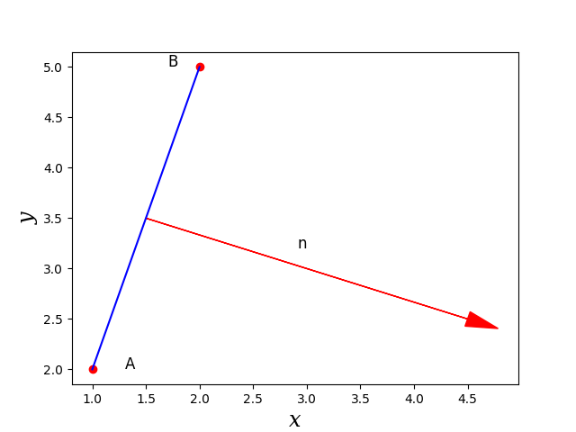
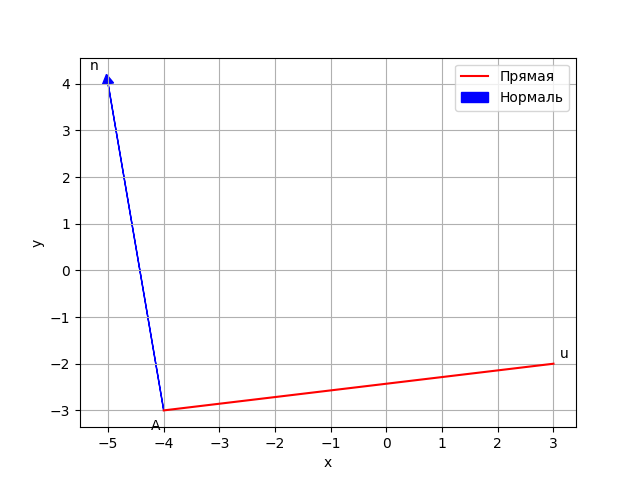
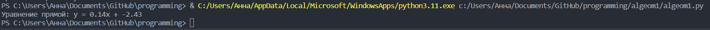
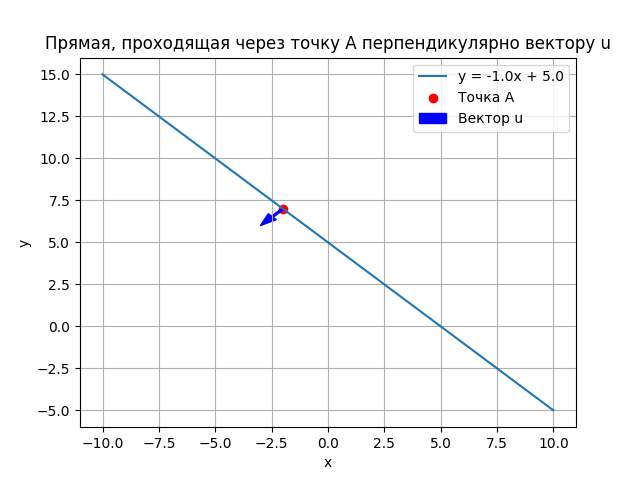
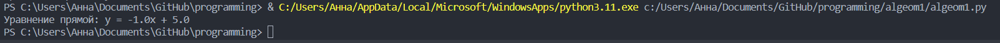

<h2 style="text-align: center;">Бюджетное учреждение высшего образования Ханты-Мансийского автономного округа – Югры</h2>  

<h1 style="text-align: center;">«СУРГУТСКИЙ ГОСУДАРСТВЕННЫЙ УНИВЕРСИТЕТ»</h1>

<h2 style="text-align: center;">Политехнический институт</h2>

<p style="text-align: center;">Кафедра прикладной математики</p>

<p style="text-align: center;">Бондаренко Анна Андреевна</p>


<p style="text-align: center;">Дисциплина «Алгебра и геометрия»</p>

<p style="text-align: center;">направление 01.03.02 «Прикладная математика и информатика»</p>

<p style="text-align: center;">направленность (профиль): «Технологии программирования и анализ данных»</p>

<pre>

</pre>

<p style="text-align: right;">Преподаватель:  </p>

<p style="text-align: right;">Шапошникова Ирина Вадимовна</p>

<p style="text-align: right;">Студент гр. № 601-31</p>

<p style="text-align: right;">Бондаренко Анна Андреевна</p>

<pre>


</pre>

<p style="text-align: center;">Сургут 2023 г.</p>

<h2 style="text-align: center;">Аналитическая геометрия. Индивидуальное задание №2.</h2>

<h3 style="text-align: center;">Вариант №2.</h3>

### Задание 1
Даны две точки $A = (1,2)$ и $B = (2,5)$. Написать программу на 
языке Python с использованием библиотек matplotlib и numpy, которая строит рисунок, изобращающий прямую, проходящую через эти точки, а также единичный вектор $n$ нормали этой прямой. На рисунке должны быть подписаны оси $Ox$ и $Oy$, точки $A$ и $B$ и вектор $n$. Построенный рисунок должен приблизительно иметь вид, показанный на рис. 1. Также программа должна выводить уравнение построенной прямой в виде $y = kx + b$.

#### Программное решение
```python
import matplotlib.pyplot as plt 
import numpy as np
if __name__ == "__main__":
    A = np.array([1, 2])
    B = np.array([2, 5])
def plot_pic():
    plt.plot([A[0], B[0]], [A[1], B[1]], color='blue')
    plt.scatter(A[0], A[1], color='red', alpha=1)
    plt.scatter(B[0], B[1], color='red', alpha=1)
    normal = np.array([B[1] - A[1], A[0] - B[0]])
    mid_point = (A + B) / 2
    plt.arrow(mid_point[0], mid_point[1], normal[0], normal[1], color='red',
head_width=0.15, head_length=0.3, fc='red', ec='red')
    plt.text(A[0] + 0.4, A[1], 'A', fontsize=12, ha='right')
    plt.text(B[0] - 0.2, B[1], 'B', fontsize=12, ha='right')
    plt.text(mid_point[0] + normal[0]/2, mid_point[1] + normal[1]/2 + 0.2, 'n',
fontsize=12, ha='right')
    plt.xlabel("x", fontsize="xx-large",
 fontstyle="italic", family="serif")
    plt.ylabel("y", fontsize="xx-large",
 fontstyle="italic", family="serif")
    plt.show()
plot_pic()
# получение уравнения прямой
k = (B[1] - A[1]) / (B[0] - A[0])
b = A[1] - k * A[0]
print(f"Уравнение прямой: y = {k}x + ({b})")

```



<p style="text-align: center;">Рис. 1. Иллюстрация решения задачи №1.</p>


<p style="text-align: center;">Рис. 2. Вывод в терминале.</p>

### Задание 2

Дана точка $𝐴 = (−4, −3)$ и вектор $u = (7, 1)$. Написать программу на языке Python сиспользованием библиотек matplotlib и numpy, которая строит рисунок,изобращающий прямую, проходящую через точку $𝐴$ в направлении вектора $u$, атакже единичный вектор $n$ нормали этой прямой. На рисунке должны бытьподписаны оси $𝑂𝑥$ и $𝑂𝑦$, точка $𝐴$ и векторы $u$ и $n$. Также программа должна выводить уравнение построенной прямой в виде $𝑦 = 𝑘𝑥 + 𝑏$.

#### Программное решение

```python
import numpy as np
import matplotlib.pyplot as plt
# Задаем точку A и вектор u
A = np.array([-4, -3])
u = np.array([7, 1])
# Вычисляем координаты конечной точки прямой
B = A + u
# Вычисляем нормальный вектор к прямой
n = np.array([-u[1], u[0]])
# Вычисляем коэффициенты уравнения прямой y = kx + b
k = u[1] / u[0]
b = A[1] - k * A[0]
# Создаем фигуру и оси
fig, ax = plt.subplots()
# Рисуем прямую, проходящую через точку A в направлении вектора u
ax.plot([A[0], B[0]], [A[1], B[1]], 'r', label='Прямая')
# Рисуем нормальный вектор
ax.arrow(A[0], A[1], n[0], n[1], head_width=0.2, head_length=0.2, fc='b', ec='b',
label='Нормаль')
# Подписываем оси
ax.set_xlabel('x')
ax.set_ylabel('y')
# Подписываем точку A и векторы u и n
ax.annotate('A', A, textcoords="offset points", xytext=(-6,-14), ha='center')
ax.annotate('u', B, textcoords="offset points",xytext=(8, 4), ha='center')
ax.annotate('n', A + n, textcoords="offset points", xytext=(-10,10), ha='center')
# Выводим уравнение прямой в терминале
print(f'Уравнение прямой: y = {round(k, 2)}x + {round(b,2)}')
# Выводим график
plt.legend()
plt.grid(True)
plt.show()

```


<p style="text-align: center;">Рис. 3. Иллюстрация решения задачи №2.</p>


<p style="text-align: center;">Рис. 4. Вывод в терминале.</p>

### Задание 3
Дана точка $𝐴 = (−2, 7)$ и вектор $u = (-1, -1)$. Написать программу на языке Python с использованием библиотек matplotlib и numpy, которая строит рисунок, изобращающий прямую, проходящую через точку $𝐴$ перпендикулярно вектору $u$. На рисунке должны быть подписаны оси $𝑂𝑥$ и $𝑂𝑦$, точка $𝐴$ и вектор $u$. Также программа должна выводить уравнение построенной прямой в виде $𝑦 = 𝑘𝑥 + 𝑏$.

#### Программное решение

```python
import numpy as np
import matplotlib.pyplot as plt
# Задаем точку A и вектор u
A = np.array([-2, 7])
u = np.array([-1, -1])
# Находим коэффициенты прямой
k = -u[0] / u[1]
b = A[1] - k * A[0]
# Создаем массив значений x
x = np.linspace(-10, 10, 100)
# Вычисляем соответствующие значения y
y = k * x + b
# Строим график
plt.plot(x, y, label='y = {}x + {}'.format(k, b))
plt.scatter(A[0], A[1], color='red', label='Точка A')
plt.arrow(A[0], A[1], u[0], u[1], color='blue', width=0.1,
head_width=0.5, length_includes_head=True, label='Вектор u')
plt.xlabel('x')
plt.ylabel('y')
plt.title('Прямая, проходящая через точку A перпендикулярно вектору u')
plt.legend()
plt.grid(True)
plt.show()
# Выводим уравнение прямой
print('Уравнение прямой: y = {}x + {}'.format(k, b))
```



<p style="text-align: center;">Рис. 5. Иллюстрация решения задачи №3.</p>


<p style="text-align: center;">Рис. 6. Вывод программы в терминале.</p>