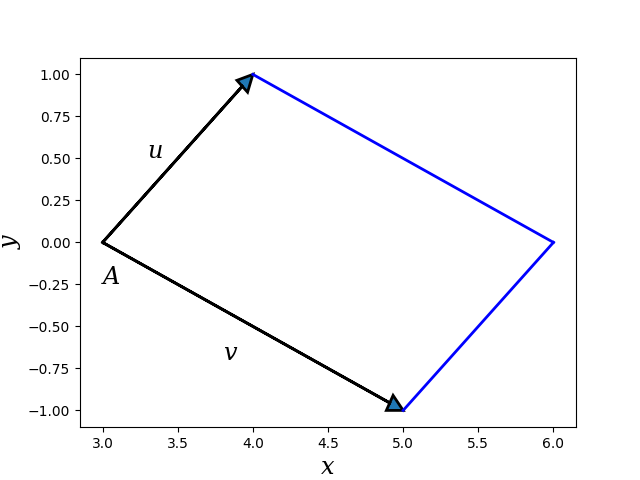
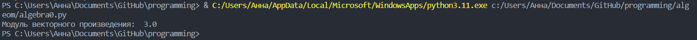
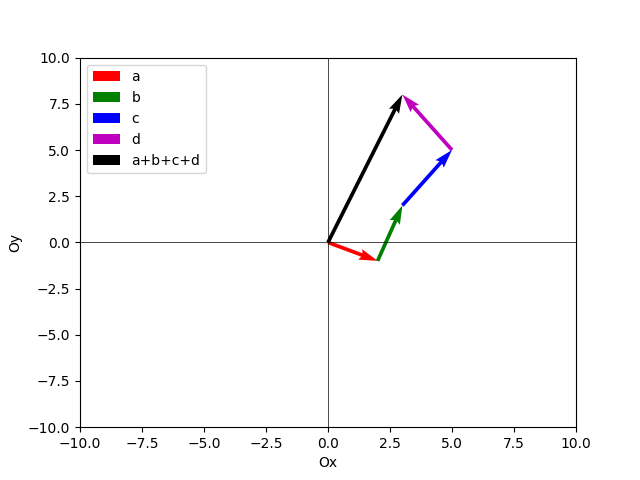
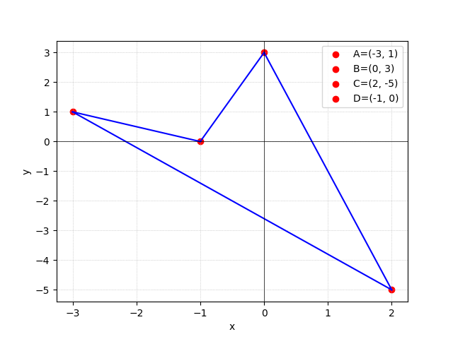
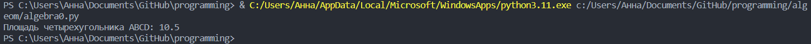

<h2 style="text-align: center;">Бюджетное учреждение высшего образования Ханты-Мансийского автономного округа – Югры</h2>  

<h1 style="text-align: center;">«СУРГУТСКИЙ ГОСУДАРСТВЕННЫЙ УНИВЕРСИТЕТ»</h1>

<h2 style="text-align: center;">Политехнический институт</h2>

<p style="text-align: center;">Кафедра прикладной математики</p>

<p style="text-align: center;">Бондаренко Анна Андреевна</p>


<p style="text-align: center;">Дисциплина «Алгебра и геометрия»</p>

<p style="text-align: center;">направление 01.03.02 «Прикладная математика и информатика»</p>

<p style="text-align: center;">направленность (профиль): «Технологии программирования и анализ данных»</p>

<pre>

</pre>

<p style="text-align: right;">Преподаватель:  </p>

<p style="text-align: right;">Шапошникова Ирина Вадимовна</p>

<p style="text-align: right;">Студент гр. № 601-31</p>

<p style="text-align: right;">Бондаренко Анна Андреевна</p>

<pre>


</pre>

<p style="text-align: center;">Сургут 2023 г.</p>

<h2 style="text-align: center;">Аналитическая геометрия. Индивидуальное задание №1.</h2>

<h3 style="text-align: center;">Вариант №2.</h3>

### Задание 1
Даны векторы , и точка . Написать программу на языке 
Python с использованием библиотек matplotlib и numpy, которая строит 
рисунок, изображающий векторы и , приложенные в точке . На рисунке 
должны быть подписаны оси и , векторы и и точка 
Также программа должна вычислить и вывести значение модуля
векторного произведения , и изобразить параллелограмм, построенный
на векторах $v$ и $u$.

$v$ = (2, -1), $u$ = (1, 1) и т. A (3, 0)

#### Программное решение
```python
import numpy as np 
import matplotlib.pyplot as plt 
import math


if __name__ == "__main__":
    v = np.array([2, -1])
    u = np.array([1, 1])
    A = np.array([3, 0])
def plot_vectors():
    #подписи координатных осей
    plt.xlabel("x", fontsize="xx-large",
    fontstyle="italic", family="serif")
    plt.ylabel("y", fontsize="xx-large",
    fontstyle="italic", family="serif")
    #изображение векторов в виде стрелок
    plt.arrow(A[0], A[1], v[0], v[1], linewidth=2,
    head_width=0.1, head_length=0.1,
    length_includes_head=True)
    plt.arrow(A[0], A[1], u[0], u[1], linewidth=2,
    head_width=0.1, head_length=0.1,
    length_includes_head=True)
    #создание подписей для A, u, v
    dr = np.array([0.0, -0.25])
    dt = np.array([1.8, 0.3])
    dp = np.array([2.3, -0.5])
    plt.text(A[0]+dr[0], A[1]+dr[1], "A", fontsize="xx-large",
fontstyle="italic", family="serif")
    plt.text(v[0]+dt[0], v[1]+dt[1], "v", fontsize="xx-large",
fontstyle="italic", family="serif")
    plt.text(u[0]+dp[0], u[1]+dp[1], "u",fontsize="xx-large",
fontstyle="italic", family="serif")
    # Вычисляем точку B путем сложения векторов
    B = A + v + u 
    # Векторы с помощью которых мы будем достраивать до параллелограмма
    z = B - v
    f = B - u
    x1, y1 = zip(z, B)
    x2, y2 = zip(f, B)
    plt.plot(x1, y1, linewidth=2, color='Blue')
    plt.plot(x2, y2, linewidth=2, color='Blue')
    plt.show()

    
plot_vectors()
vA = np.array([A[0]-v[0], A[1]-v[1]])
uA = np.array([A[0]-u[0], A[1]-u[1]])
# Вычисление векторного произведения
vp = np.cross(vA, uA)
# Вычисление модуля векторного произведения
vp_mod = np.linalg.norm(vp)
print("Модуль векторного произведения: ", vp_mod)

```



<p style="text-align: center;">Рис. 1. Иллюстрация решения задачи №1.</p>



<p style="text-align: center;">Рис. 2. Вывод в терминале.</p>

### Задание 2

Даны векторы , , . Написать программу на языке Python с 
использованием библиотек matplotlib и numpy, которая строит рисунок 
следующим образом: 
1) вектор $a$ приложен в начале координат;
2) вектор $b$ приложен в конце вектора $a$;
3) вектор $c$ приложен в конце вектора $b$;
4) вектор $d$ приложен в конце вектора $c$;
5) вектор $a+b+c+d$ приложен в начале координат.
На рисунке должны быть подписаны оси $Ox$ и $Oy$, а также все построенные векторы.

$a$ = (2,-1), $b$ = (1,3), $c$ = (2, -3), $d$ = (-2, 3)

#### Программное решение

```python
import numpy as np
import matplotlib.pyplot as plt
# Задание векторов
a = np.array([2, -1])
b = np.array([1, 3])
c = np.array([2, 3])
d = np.array([-2, 3])
# Создание фигуры и осей
fig, ax = plt.subplots()
def plot_vectors():
    # Построение векторов
    ax.quiver(0, 0, a[0], a[1], angles='xy', scale_units='xy', scale=1,
color='r', label='a')
    ax.quiver(a[0], a[1], b[0], b[1], angles='xy', scale_units='xy', scale=1,
color='g', label='b')
    ax.quiver(a[0]+b[0], a[1]+b[1], c[0], c[1], angles='xy', scale_units='xy',
scale=1, color='b', label='c')
    ax.quiver(a[0]+b[0]+c[0], a[1]+b[1]+c[1], d[0], d[1], angles='xy',
scale_units='xy', scale=1, color='m', label='d')
    ax.quiver(0, 0, a[0]+b[0]+c[0]+d[0], a[1]+b[1]+c[1]+d[1], angles='xy',
scale_units='xy', scale=1, color='k', label='a+b+c+d')
    # Настройка осей и меток
    ax.set_xlim([-10, 10])
    ax.set_ylim([-10, 10])
    ax.axhline(0, color='black',linewidth=0.5)
    ax.axvline(0, color='black',linewidth=0.5)
    ax.set_xlabel('Ox')
    ax.set_ylabel('Oy')
    # Добавление легенды
    ax.legend()
    # Отображение рисунка
    plt.show()

    
plot_vectors()

```

<p style="text-align: center;">Рис. 3. Иллюстрация решения задачи №2.</p>

### Задание 3
Даны точки $A$, $B$, $C$, $D$. Написать программу на языке Python с использованием библиотек matplotlib и numpy, которая строит 
четырехугольник $ABCD$ и вычисляет его площадь при помощи векторного 
произведения. На рисунке должны быть подписаны оси $Ox$ и $Oy$, а также точки $A$, $B$, $C$, $D$.

$A$(-3,1), $B$(0,3), $C$(2, -5), $D$(-1, 0) 

#### Программное решение

```python
import numpy as np
import matplotlib.pyplot as plt
A = np.array([-3, 1])
B = np.array([0, 3])
C = np.array([2, -5])
D = np.array([-1, 0])

def plot_pic():
    plt.plot([A[0], D[0]], [A[1], D[1]], color='b')
    plt.plot([B[0], C[0]], [B[1], C[1]], color='b')
    plt.plot([C[0], A[0]], [C[1], A[1]], color='b')
    plt.plot([D[0], B[0]], [D[1], B[1]], color='b')
    plt.scatter(A[0], A[1], color='red', label='A=(-3, 1)', alpha=1)
    plt.scatter(B[0], B[1], color='red', label='B=(0, 3)', alpha=1)
    plt.scatter(C[0], C[1], color='red', label='C=(2, -5)', alpha=1)
    plt.scatter(D[0], D[1], color='red', label='D=(-1, 0)', alpha=1)
    dA = np.array([0.2, 0.15])
    dB = np.array([-0.4, -0.1])
    dC = np.array([-0.7, 0.1])
    dD = np.array([0.4, 0.1])
    plt.xlabel('x')
    plt.ylabel('y')
    plt.legend()
    plt.axhline(0, color='black',linewidth=0.5)
    plt.axvline(0, color='black',linewidth=0.5)
    plt.grid(True, linewidth=0.5, linestyle='dotted')
    plt.show()


plot_pic()
# Вычисление площади четырехугольника ABCD
S = 0.5 * np.abs(np.cross(B - A, D - C))
print("Площадь четырехугольника ABCD:", S)

```


<p style="text-align: center;">Рис. 4. Иллюстрация решения задачи №3.</p>



<p style="text-align: center;">Рис. 5. Вывод в терминале.</p>