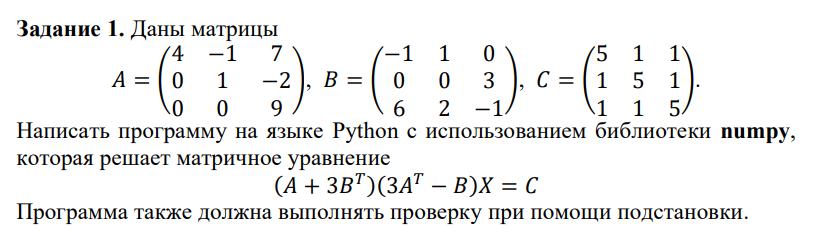
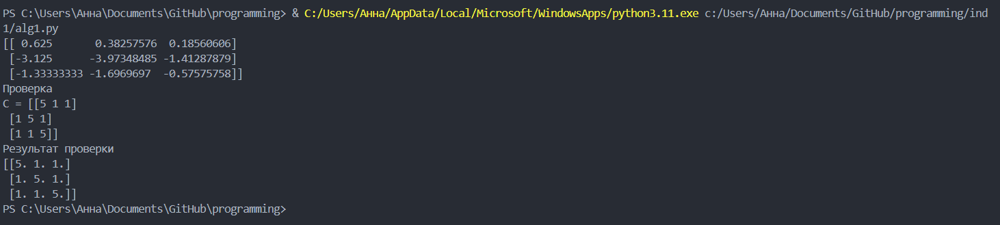
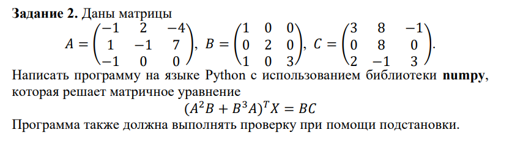
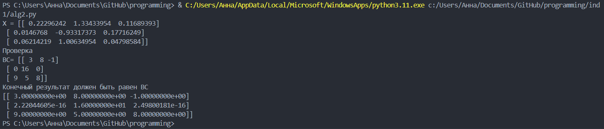
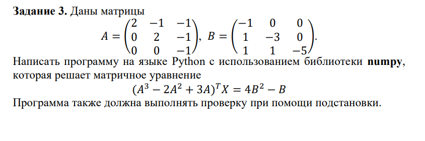
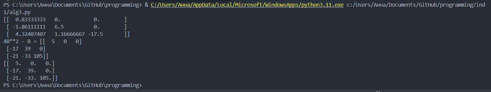

<h2 style="text-align: center;">Бюджетное учреждение высшего образования Ханты-Мансийского автономного округа – Югры</h2>  

<h1 style="text-align: center;">«СУРГУТСКИЙ ГОСУДАРСТВЕННЫЙ УНИВЕРСИТЕТ»</h1>

<h2 style="text-align: center;">Политехнический институт</h2>

<p style="text-align: center;">Кафедра прикладной математики</p>

<p style="text-align: center;">Бондаренко Анна Андреевна</p>

<h1 style="text-align: center;">ИНДИВИДУАЛЬНОЕ ЗАДАНИЕ №1</h1>

<p style="text-align: center;">Дисциплина «Линейная алгебра»</p>

<p style="text-align: center;">направление 01.03.02 «Прикладная математика и информатика»</p>

<p style="text-align: center;">направленность (профиль): «Технологии программирования и анализ данных»</p>
 

<p style="text-align: right;">Студент гр. № 601-31</p>

<p style="text-align: right;">Бондаренко Анна Андреевна</p>

<pre>


</pre>

<p style="text-align: center;">Сургут 2024 г.</p>

### Задание 1


#### Программное решение

```python
import numpy as np

A = np.array([[4,-1,7],[0,1,-2],[0,0,9]])
B = np.array([[-1,1,0],[0,0,3],[6,2,-1]])
C = np.array([[5,1,1],[1,5,1],[1,1,5]])

D = (A + 3*B.T)*(3*A.T - B)
X = np.dot(np.linalg.inv(D),C)
print(X)
print('Проверка')
print('C =', C)
print('Результат проверки')
print(np.dot(D,X))
```

#### Вывод в терминале


### Задание 2


#### Программное решение

```python
import numpy as np
from numpy.linalg import matrix_power

A = np.array([[-1,2,-4], [1,-1,7], [-1,0,0]])
B = np.array([[1,0,0],[0,2,0],[1,0,3]])
C = np.array([[3,8,-1],[0,8,0],[2,-1,3]])
D = (np.dot(matrix_power(A,2), B) + np.dot(matrix_power(B,3),A)).T
F = np.dot(B,C)
X = np.dot(np.linalg.inv(D),F)
print('X =', X)
print('Проверка')
print('BC=', F)
print('Конечный результат должен быть равен ВС')
print(np.dot(D,X))
```
#### Вывод в терминале


### Задание 3


#### Программное решение
```python
import numpy as np
from numpy.linalg import matrix_power

A = np.array([[2,-1,-1],[0,2,-1],[0,0,-1]])
B = np.array([[-1,0,0],[1,-3,0],[1,1,-5]])
C = (matrix_power(A,3) - 2*matrix_power(A,2) + 3*A).T
D = 4*matrix_power(B,2)-B
X = np.dot(np.linalg.inv(C), D)
print(X)
print('4B**2 - B =', D)
print(np.dot(C,X))
```

#### Вывод в терминале

