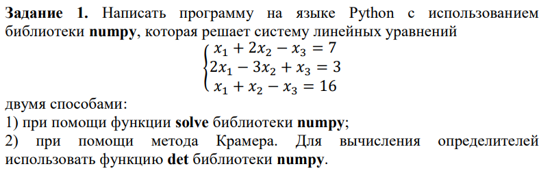
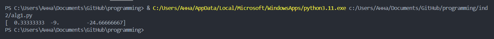
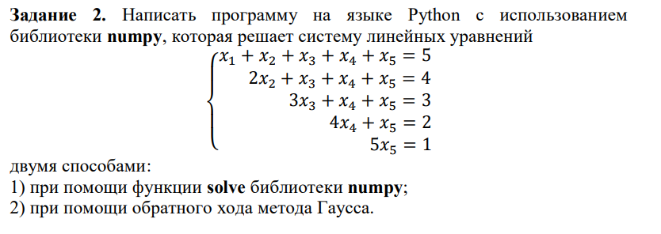
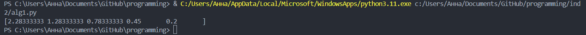
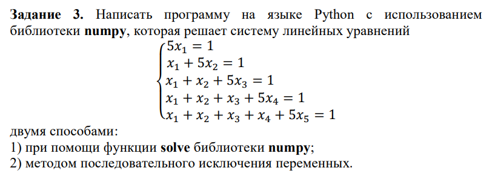
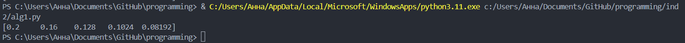

<h2 style="text-align: center;">Бюджетное учреждение высшего образования Ханты-Мансийского автономного округа – Югры</h2>  

<h1 style="text-align: center;">«СУРГУТСКИЙ ГОСУДАРСТВЕННЫЙ УНИВЕРСИТЕТ»</h1>

<h2 style="text-align: center;">Политехнический институт</h2>

<p style="text-align: center;">Кафедра прикладной математики</p>

<p style="text-align: center;">Бондаренко Анна Андреевна</p>

<h1 style="text-align: center;">ИНДИВИДУАЛЬНОЕ ЗАДАНИЕ №2</h1>

<p style="text-align: center;">Дисциплина «Линейная алгебра»</p>

<p style="text-align: center;">направление 01.03.02 «Прикладная математика и информатика»</p>

<p style="text-align: center;">направленность (профиль): «Технологии программирования и анализ данных»</p>
 

<p style="text-align: right;">Студент гр. № 601-31</p>

<p style="text-align: right;">Бондаренко Анна Андреевна</p>

<pre>


</pre>

<p style="text-align: center;">Сургут 2024 г.</p>

### Задание 1


#### Программное решение

1. При помощи функции solve библиотеки numpy

```python
import numpy as np
from numpy.linalg import det

if __name__ == "__main__":
 A = np.array([[1,2,-1],[2,-3,1],[1,1,-1]])
 b = np.array([7,3,16])
 x = np.linalg.solve(A,b)
 print(x)
```
2. При помощи метода Крамера с использованием функции det библиотеки numpy

```python
import numpy as np
from numpy.linalg import det

    
A = np.array([[1,2,-1],[2,-3,1],[1,1,-1]])
A1 = np.array([[7,2,-1],[3,-3,1],[16,1,-1]])
A2 = np.array([[1,7,-1],[2,3,1],[1,16,-1]])
A3 = np.array([[1,2,7],[2,-3,3],[1,1,16]])
b = np.array([7,3,16])
oA = det(A)
oA1 = det(A1)
oA2 = det(A2)
oA3 = det(A3)
m123 = np.array([oA1,oA2,oA3])
X = (1/oA) * m123
print(X)
```
#### Вывод в терминале

В результате работы двух программ вывод получается одинаковым в обоих случаях, поэтому тут присутсвтует всего 1 скриншот



### Задание 2


#### Программное решение
1. При помощи функции solve библиотеки numpy
```python
import numpy as np

A = np.array([[1,1,1,1,1],[0,2,1,1,1],[0,0,3,1,1],[0,0,0,4,1],[0,0,0,0,5]])
b = np.array([5,4,3,2,1])
x = np.linalg.solve(A,b)
print(x)
```
2. При помощи обратного хода метода Гаусса

```python
import numpy as np

A = np.array([[1,1,1,1,1],[0,2,1,1,1],[0,0,3,1,1],[0,0,0,4,1],[0,0,0,0,5]])
b = np.array([5,4,3,2,1])

x5 = 1/5
x4 = (2 - x5) / 4
x3 = (3 - x4 - x5) / 3
x2 = (4 - x3 - x4 -x5) / 2
x1 = 5 - x2 - x3 - x4 - x5
x = np.array([x1, x2, x3, x4, x5])
print(x)
```
#### Вывод в терминале
В результате работы двух программ вывод получается одинаковым в обоих случаях, поэтому тут присутсвтует всего 1 скриншот



### Задание 3


#### Программное решение
1. При помощи функции solve библиотеки numpy

```python
import numpy as np

A = np.array([[5,0,0,0,0],[1,5,0,0,0],[1,1,5,0,0],[1,1,1,5,0],[1,1,1,1,5]])
b = np.array([1,1,1,1,1])
x = np.linalg.solve(A,b)

print(x)
```
2. Методом последовательного исключения переменных

```python
import numpy as np

A = np.array([[5,0,0,0,0],[1,5,0,0,0],[1,1,5,0,0],[1,1,1,5,0],[1,1,1,1,5]])
b = np.array([1,1,1,1,1])

x1 = 1/5
x2 = (1 - x1)/5
x3 = (1 - x1 - x2)/5
x4 = (1 - x1 - x2 - x3)/5
x5 = (1 - x1 - x2 - x3 - x4)/5
x = np.array([x1,x2,x3,x4,x5])

print(x)
```
#### Вывод в терминале 

В результате работы двух программ вывод получается одинаковым в обоих случаях, поэтому тут присутсвтует всего 1 скриншот

