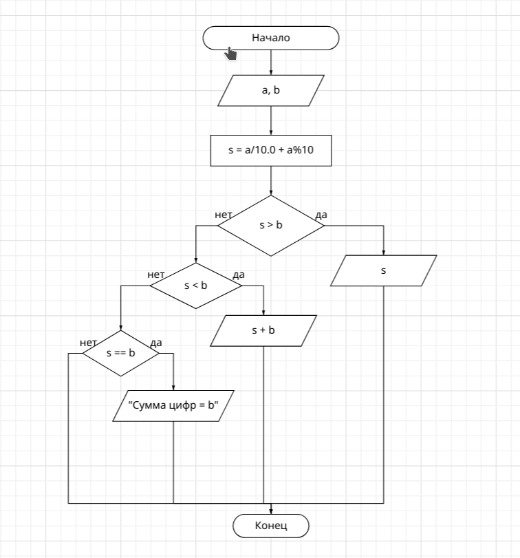
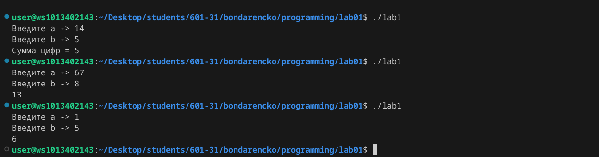

# Лабораторная работа №1
## Задание 1: Разобрать код программы из примера (я его разобрала)
## Задание 2: Составить блок-схему алгоритма для своего варианта


## Задание 3: Написать программу, решающую задачу по своему варианту
### Вариант 1: Вывести сумму цифр числа a если она больше b, если равна b - сообщение Сумма цифр = b, и значение суммы, увеличенное на b, если сумма меньше b.
### Программа:
```c
#include <stdio.h>

int main()
{
    int a, b, s;
    printf("Введите a -> ");
    scanf("%d", &a);
    printf("Введите b -> ");
    scanf("%d", &b);
    s = a / 10.0 + a % 10;
    if (s > b)
        printf("%d\n", s);
    if (s < b)
        printf("%d\n", s + b);
    if (s == b)
        printf("Сумма цифр = %d\n", b);
}
```
### Результат:

## Задание 4: Написать отчет в README.md
### Это и есть отчет в README.md
