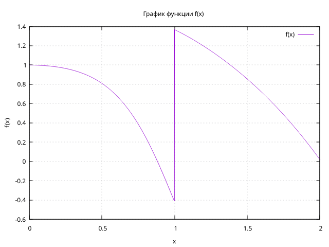
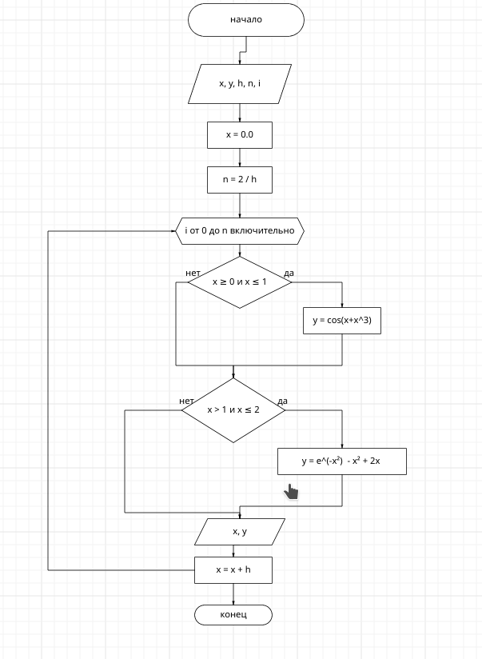

# Лабораторная работа №2
## Задание
1. Напишите программу по варианту, используя оператор цикла while (нечётные варианты) или do while (чётные варианты).
2. Напишите программу, используя оператор цикла for.
3. Постройте график с использованием gnuplot.
4. Составьте блок-схемы.
5. Оформите отчёт в README.md. Отчёт должен содержать:

    *Задание

    *Описание проделанной работы

    *Скриншоты результатов

    *Блок-схемы

    *График функции

    *Ссылки на используемые материалы
## Ход работы

### 1. Напишите программу по варианту, используя оператор цикла while (нечётные варианты) или do while (чётные варианты).
Вариант 1
```
#include <stdio.h>
#include <math.h>

int main()
{
    double x, y, h;
    x = 0.0;
    scanf("%lf", &h);
    int n, k = 0;
    n = 2 / h;
    while (k <= n)
    {
        if (x >= 0 && x <= 1)
          y = cos(x + x * x * x);  
        if (x > 1 && x <= 2)
          y = exp(-x * x) - x * x + 2 * x;  
        printf("%lf %lf\n", x, y);
        x += h;
        k += 1;
    }
}

```
### 2. Напишите программу, используя оператор цикла for.

```
#include <stdio.h>
#include <math.h>

int main()
{
  double x, y, h;
  x = 0.0;
  scanf("%lf", &h);
  int n, i;
  n = 2 / h;
  for (i = 0; i <= n; i++)
  {
    if (x >= 0 && x <= 1)
      y = cos(x + x * x * x);  
    if (x > 1 && x <= 2)
      y = exp(-x * x) - x * x + 2 * x; 
    printf("%lf %lf\n", x, y);
    x += h; 
  }
}
```

### 3. Постройте график с использованием gnuplot.


### 4. Составьте блок-схемы.
#### Блок-схема для кода с циклом for.

#### Блок-схема для кода с циклом while
