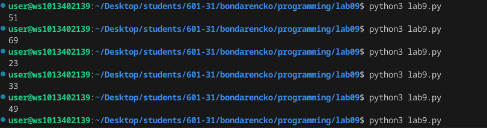

# Лабораторная работа №9
## Задание 
1. Решите задачу своего варианта.
2. Оформите отчёт в README.md.

## Ход работы 
### 1. Решите задачу своего варианта.
Вариант 1

Генератор случайных чисел в заданном диапазоне. Не используйте готовые реализации ГПСЧ.

```python
import time

def rand_num(min_val, max_val):
    seed = int(time.time() * 1000)
    random_ch = (seed % (max_val - min_val + 1)) + min_val
    return random_ch

mins = 20
maxs = 70 
print(rand_num(mins, maxs))
```

Результат


### 2. Оформите отчёт в README.md.
Это и есть отчет в README.md))
