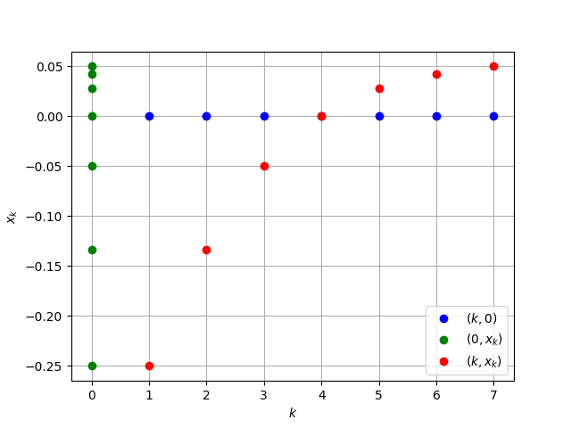
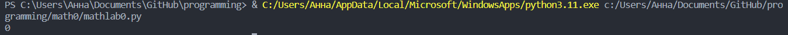
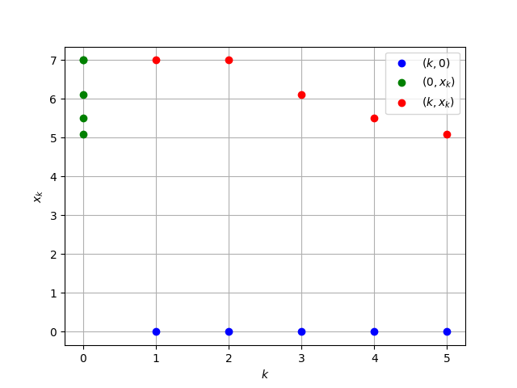
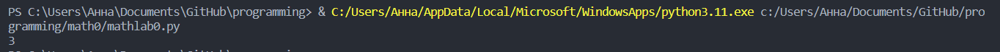
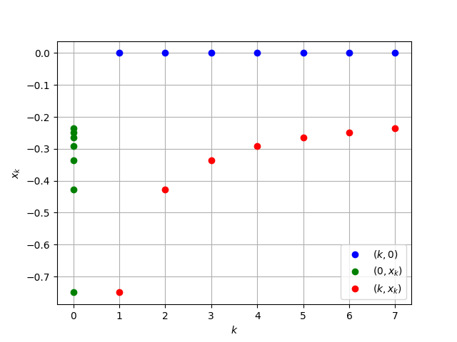
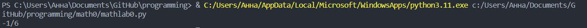

<h2 style="text-align: center;">Бюджетное учреждение высшего образования Ханты-Мансийского автономного округа – Югры</h2>  

<h1 style="text-align: center;">«СУРГУТСКИЙ ГОСУДАРСТВЕННЫЙ УНИВЕРСИТЕТ»</h1>

<h2 style="text-align: center;">Политехнический институт</h2>

<p style="text-align: center;">Кафедра прикладной математики</p>

<p style="text-align: center;">Бондаренко Анна Андреевна</p>

<h1 style="text-align: center;">ТЕМА ИНДИВИДУАЛЬНОГО ЗАДАНИЯ</h1>

<p style="text-align: center;">Дисциплина «Математический анализ»</p>

<p style="text-align: center;">направление 01.03.02 «Прикладная математика и информатика»</p>

<p style="text-align: center;">направленность (профиль): «Технологии программирования и анализ данных»</p>

<pre>

</pre>

<p style="text-align: right;">Преподаватель:  </p>

<p style="text-align: right;">Ряховский Алексей Васильевич, доцент</p>

<p style="text-align: right;">Студент гр. № 601-31</p>

<p style="text-align: right;">Бондаренко Анна Андреевна</p>

<pre>


</pre>

<p style="text-align: center;">Сургут 2023 г.</p>

<h3 style="text-align: center;">Лабораторная работа №1. Числовые последовательности.</h3>

#### Задание

Вычислить пределы данных числовых последовательностей двумя способами: 

- аналитически 
- используя библиотеки Python для символьных вычислений. 

Для каждой числовой последовательности $\{x_k\}_{k=1}^\infty$ на одном рисунке построить (используя графические пакеты Python) следующие множества точек ($k = 1, \ldots, m$):

- (k, 0) – синий цвет
- (0, $x_k$) – зеленый цвет
- (k, $x_k$) – красный цвет

В случае, если последовательность сходится, построить на соответствующем рисунке точку (оранжевый цвет) изображающую предел последовательности $\{x_k\}_{k=1}^\infty$.

В задаче 1 для сходящихся последовательностей, для заданного $\varepsilon>0$ найти такой номер $n(\varepsilon)$, начиная с которого $|x_k-A|<\varepsilon, \forall k\geq n(\varepsilon)$ 

#### Аналитическое решение

Рассмотрим предел: 

$\lim\limits_{n\rightarrow\infty}\frac{n-4}{n^2+11}$

Найдем пределы числителя и знаменателя: 

  - $\lim\limits_{n\rightarrow\infty}(n-4)=+\infty$
  - $\lim\limits_{n\rightarrow\infty}(n^2+11)=+\infty$

Поскольку выражение $\frac{\infty}{\infty}$ является неопределенностью, преобразуем его, деля каждое слагаемое в числителе и знаменателе на старшую степень, в данном случае это $n^2$:

$\lim\limits_{n\rightarrow\infty}\frac{n-4}{n^2+11} = \lim\limits_{n\rightarrow\infty} \frac{\frac{n-4}{n^2}}{\frac{n^2+11}{n^2}} = \lim\limits_{n\rightarrow\infty} \frac{\frac{1}{n} - \frac{4}{n^2}}{1 + \frac{11}{n^2}}$

Вычислим предел числителя, вычисляя предел каждого слагаемого:

- $\lim\limits_{n\rightarrow\infty} (\frac{1}{n} - \frac{4}{n^2})$
   - $\lim\limits_{n\rightarrow\infty} \frac{1}{n} = 0$
   - $\lim\limits_{n\rightarrow\infty}\frac{4}{n^2} = 0$


Следовательно:
$\lim\limits_{n\rightarrow\infty} (\frac{1}{n} - \frac{4}{n^2}) = 0 - 0 = 0$

Аналогично для знаменателя:
$\lim\limits_{n\rightarrow\infty}(1 + \frac{11}{n^2}) = 1$

Таким образом, предел числителя равен $0$, а предел знаменателя равен $1$. Отношение бесконечно малой к сходящейтся последовательности является бесконечно малой, поэтому предел будет равен $0$: 

$\lim\limits_{n\rightarrow\infty}\frac{n-4}{n^2+11} = 0$

Ответ: $0$

Найдем номер $n_\varepsilon$:

$\varepsilon = 0.001$

$|\frac{n-4}{n^2+11}|<0.001$

$\frac{n-4}{n^2+11} < \frac{n-4}{n^2} < \frac{n}{n^2} = \frac{1}{n} < \varepsilon$

$\frac{1}{n} < 0.001$

Ответ: $n_\varepsilon < 1000$
#### Программное решение

```python
import matplotlib.pyplot as plt
import numpy as np
from sympy import *

def sequence(n):
    return (n-4) / (n**2 + 11)

def plot_points(m):
    x = np.arange(1, m+1)
    y = sequence(x)

    # (k, 0) - blue colour
    plt.plot(x, np.zeros_like(x), 'bo', label='$(k, 0)$')

    # (0, x_k) - green color
    plt.plot(np.zeros_like(x), y, 'go', label='$(0, x_k)$')

    # (k, x_k) - red color
    plt.plot(x, y, 'ro', label='$(k, x_k)$')

    plt.xlabel('$k$')
    plt.ylabel('$x_k$')
    plt.legend()
    plt.grid()
    plt.show()

m = 7  # number of points
plot_points(m)

n = Symbol("n")  
a = limit((n-4)/(n**2+11), n, oo)  
print(a)
```
<pre>

</pre>

#### Иллюстрация решения


<p style="text-align: center;">Рис. 1. Иллюстрация решения задачи.</p>


<p style="text-align: center;">Рис. 2. Вывод программы в терминале.</p>

#### Задача 2
#### Аналитическое решение

Рассмотрим предел: 

$\lim\limits_{n\rightarrow\infty}\frac{\sqrt[n]{8n^3}-1}{\sqrt[n]{2n}-1}$

Найдем пределы числителя и знаменателя: 

  - $\lim\limits_{n\rightarrow\infty}(\sqrt[n]{8n^3}-1)=0$
  - $\lim\limits_{n\rightarrow\infty}(\sqrt[n]{2n}-1)=0$

Поскольку выражение $\frac{0}{0}$ является неопределенностью, преобразуем его, раскрывая формулу разности кубов в числителе, и сократим одинаковые скобки в числителе и знаменателе:

$\lim\limits_{n\rightarrow\infty}\frac{\sqrt[n]{8n^3}-1}{\sqrt[n]{2n}-1} = \lim\limits_{n\rightarrow\infty}\frac{(\sqrt[n]{2n}-1)(\sqrt[n]{4n^2} + \sqrt[n]{2n} + 1)}{\sqrt[n]{2n}-1} = \lim\limits_{n\rightarrow\infty} (\sqrt[n]{4n^2} + \sqrt[n]{2n} + 1)$

Вычислим предел, вычисляя предел каждого слагаемого:

- $\lim\limits_{n\rightarrow\infty} (\sqrt[n]{4n^2} + \sqrt[n]{2n} + 1)$
   - $\lim\limits_{n\rightarrow\infty} \sqrt[n]{4n^2} = 1$
   - $\lim\limits_{n\rightarrow\infty} \sqrt[n]{2n}= 1$
   - $\lim\limits_{n\rightarrow\infty} 1 = 1$


Следовательно:
$\lim\limits_{n\rightarrow\infty} (\sqrt[n]{4n^2} + \sqrt[n]{2n} + 1) = 1 + 1 + 1 = 3$


$\lim\limits_{n\rightarrow\infty} (\sqrt[n]{4n^2} + \sqrt[n]{2n} + 1) = 3$

Ответ: $3$

#### Программное решение

```python
import matplotlib.pyplot as plt
import numpy as np
from sympy import *

def sequence(n):
    return ((8*n**3)**(1/n) - 1) / ((2*n)**(1/n) - 1)

def plot_points(m):
    x = np.arange(1, m+1)
    y = sequence(x)

    # (k, 0) - blue colour
    plt.plot(x, np.zeros_like(x), 'bo', label='$(k, 0)$')

    # (0, x_k) - green color
    plt.plot(np.zeros_like(x), y, 'go', label='$(0, x_k)$')

    # (k, x_k) - red color
    plt.plot(x, y, 'ro', label='$(k, x_k)$')

    plt.xlabel('$k$')
    plt.ylabel('$x_k$')
    plt.legend()
    plt.grid()
    plt.show()

m = 5  # number of points
plot_points(m)

n = Symbol("n")  
a = limit(((8*n**3)**(1/n) - 1) / ((2*n)**(1/n) - 1), n, oo)  
print(a) 

```
<pre>

</pre>

#### Иллюстрация решения


<p style="text-align: center;">Рис. 1. Иллюстрация решения задачи.</p>


<p style="text-align: center;">Рис. 2. Вывод программы в терминале.</p>

#### Задача 3
#### Аналитическое решение

Рассмотрим предел: 

$\lim\limits_{n\rightarrow\infty}(\frac{n^2}{3n+1} - \frac{2n^2+3}{6n-1})$

Сложим дроби в пределе: 

  - $\lim\limits_{n\rightarrow\infty}(\frac{n^2}{3n+1} - \frac{2n^2+3}{6n-1}) = \lim\limits_{n\rightarrow\infty}\frac{n^2(6n-1)-(3n+1)(2n^2+3)}{(3n+1)(6n-1)} = \lim\limits_{n\rightarrow\infty}\frac{-3n^2-9n-3}{18n^2+3n-1}$

Найдем пределы числителя и знаменателя: 

  - $\lim\limits_{n\rightarrow\infty}(-3n^2-9n-3)=-\infty$
  - $\lim\limits_{n\rightarrow\infty}(18n^2+3n-1)=+\infty$


Поскольку выражение $\frac{-\infty}{+\infty}$ является неопределенностью, преобразуем его, деля каждое слагаемое в числителе и знаменателе на старшую степень, в данном случае это $n^2$:

$\lim\limits_{n\rightarrow\infty}\frac{-3n^2-9n-3}{18n^2+3n-1} = \lim\limits_{n\rightarrow\infty}\frac{\frac{-3n^2-9n-3}{n^2}}{\frac{18n^2+3n-1}{n^2}} = \lim\limits_{n\rightarrow\infty}\frac{-3-\frac{9}{n}-\frac{3}{n^2}}{18+\frac{3}{n}-\frac{1}{n^2}}$

Вычислим предел числителя, вычисляя предел каждого слагаемого:

- $\lim\limits_{n\rightarrow\infty} (-3-\frac{9}{n}-\frac{3}{n^2})$
   - $\lim\limits_{n\rightarrow\infty} (-3) = -3$
   - $\lim\limits_{n\rightarrow\infty}(-\frac{9}{n}) = 0$
   - $\lim\limits_{n\rightarrow\infty}(- \frac{3}{n^2}) = 0$

Следовательно:
$\lim\limits_{n\rightarrow\infty} (-3-\frac{9}{n}-\frac{3}{n^2}) = - 3 - 0 - 0 = -3$

Аналогично для знаменателя:
$\lim\limits_{n\rightarrow\infty}(18+\frac{3}{n}-\frac{1}{n^2}) = 18$

Таким образом, предел числителя равен $-3$, а предел знаменателя равен $18$, поэтому предел будет равен $-\frac{1}{6}$:

$\lim\limits_{n\rightarrow\infty}(\frac{n^2}{3n+1} - \frac{2n^2+3}{6n-1}) = -\frac{1}{6}$

Ответ: $-\frac{1}{6}$

#### Программное решение
```python
import matplotlib.pyplot as plt
import numpy as np
from sympy import *

def sequence(n):
    return (((n**2) / (3*n + 1)) - ((2*n**2 + 3) / (6*n - 1)))

def plot_points(m):
    x = np.arange(1, m+1)
    y = sequence(x)

    # (k, 0) - blue colour
    plt.plot(x, np.zeros_like(x), 'bo', label='$(k, 0)$')

    # (0, x_k) - green color
    plt.plot(np.zeros_like(x), y, 'go', label='$(0, x_k)$')

    # (k, x_k) - red color
    plt.plot(x, y, 'ro', label='$(k, x_k)$')

    plt.xlabel('$k$')
    plt.ylabel('$x_k$')
    plt.legend()
    plt.grid()
    plt.show()

m = 7  # number of points
plot_points(m)

n = Symbol("n")  
a = limit(((n**2) / (3*n + 1)) - ((2*n**2 + 3) / (6*n - 1)), n, oo) 
print(a) 
```
<pre>

</pre>

#### Иллюстрация решения


<p style="text-align: center;">Рис. 1. Иллюстрация решения задачи.</p>


<p style="text-align: center;">Рис. 2. Вывод программы в терминале.</p>