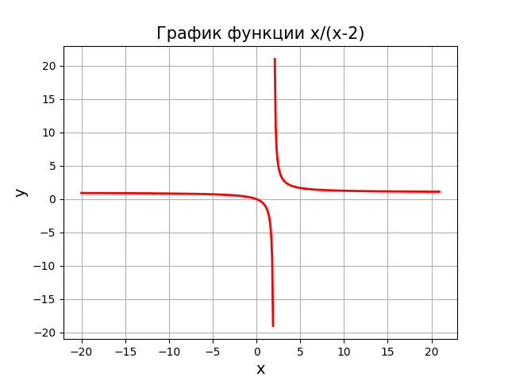
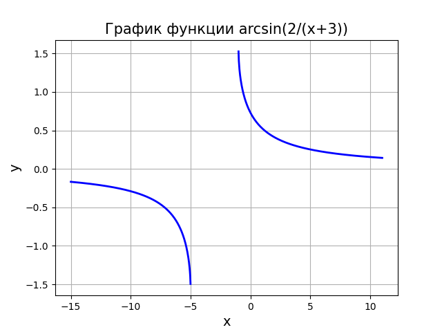

<h2 style="text-align: center;">Бюджетное учреждение высшего образования Ханты-Мансийского автономного округа – Югры</h2>  

<h1 style="text-align: center;">«СУРГУТСКИЙ ГОСУДАРСТВЕННЫЙ УНИВЕРСИТЕТ»</h1>

<h2 style="text-align: center;">Политехнический институт</h2>

<p style="text-align: center;">Кафедра прикладной математики</p>

<p style="text-align: center;">Бондаренко Анна Андреевна</p>

<h1 style="text-align: center;">ТЕМА ИНДИВИДУАЛЬНОГО ЗАДАНИЯ</h1>

<p style="text-align: center;">Дисциплина «Математический анализ»</p>

<p style="text-align: center;">направление 01.03.02 «Прикладная математика и информатика»</p>

<p style="text-align: center;">направленность (профиль): «Технологии программирования и анализ данных»</p>

<pre>

</pre>

<p style="text-align: right;">Преподаватель:  </p>

<p style="text-align: right;">Ряховский Алексей Васильевич, доцент</p>

<p style="text-align: right;">Студент гр. № 601-31</p>

<p style="text-align: right;">Бондаренко Анна Андреевна</p>

<pre>


</pre>

<p style="text-align: center;">Сургут 2023 г.</p>

<h3 style="text-align: center;">Лабораторная работа №2. Числовые последовательности.</h3>

#### Задание
1. Аналитически найти область определения функций, а затем построить их графики, используя графические пакеты Python. Для каждой из функций график построить на отдельном рисунке.

2. Вычислить пределы данных функций двумя способами: аналитически и используя библиотеки Python для символьных вычислений. Используя графические пакеты Python, построить графики функций, иллюстрирующие поведение функций в окрестностях тех точек, в которых вычисляется предел. Если предел существует, построить на соответствующем рисунке точку, изображающую предел данной функции.

3. Найти (аналитически и используя библиотеки Python для символьных вычислений) точки разрыва функции и определить их тип. Используя графические пакеты Python построить графики функций, иллюстрирующие поведение функций в окрестностях точек разрыва.

#### Задача 1

Найти область определения и построить графики следующих функций:

$\frac{x}{x-2}$ , $arcsin(\frac{2}{x+3})$

Найдем область определения первой функции:

$\frac{x}{x-2}$

$x-2= 0 \rightarrow x \neq 2$

Отсюда следует, что $x \in (- \infin, 2) \cup (2, + \infin)$

Найдем область определения второй функции:

$arcsin(\frac{2}{x+3})$

Область определения арксинуса это все значения $x$, при которых аргумент принадлежит промежутку $[-1,1]$ :

$\frac{2}{x+3} \in [-1,1]$

Решим систему:

$\begin{cases} \frac{2}{x+3} \geq -1 \\
\frac{2}{x+3} \leq 1
\end{cases}$

$\begin{cases} \frac{2+x+3}{x+3} \geq 0 \\
\frac{2-(x+3)}{x+3} \leq 0
\end{cases}$

$\begin{cases} \frac{5+x}{x+3} \geq 0 \\
\frac{-1-x}{x+3} \leq 0
\end{cases}$

$\begin{cases} \begin{cases} 5+x \geq 0 \\ x+3 > 0 \end{cases} \\
\begin{cases} 5+x \leq 0 \\ x+3 < 0 \end{cases} \\
\begin{cases} -1-x \leq0 \\ x+3 > 0 \end{cases} \\
\begin{cases} -1-x \geq 0 \\ x+3 <0 \end{cases}
\end{cases}$

$\begin{cases} \begin{cases} x \geq 5 \\ x > -3 \end{cases} \\
\begin{cases} x \leq -5 \\ x < -3 \end{cases} \\
\begin{cases} x \geq -1 \\ x > -3 \end{cases} \\
\begin{cases} x \leq -1 \\ x < -3 \end{cases}
\end{cases}$

Найдем объединение и пересечение всех получившихся промежутков:

$x \in (-\infin, -5] \cup [-1, +\infin)$

Построим графики данных функций

Программа:

```python
import matplotlib.pyplot as plt
import numpy as np
import sympy as sp
from sympy import Symbol,limit
from math import pi,log


def pic1():
    x = [round(i, 2) for i in np.arange(-20, 21, 0.1)]
    y = [round((i/(i-2)),2) for i in x]
    plt.plot(x, y, linewidth=2, color='red')
    plt.title('График функции x/(x-2)', fontsize=15)
    plt.xlabel('x', fontsize=14)
    plt.ylabel('y', fontsize=14) 
    plt.grid(True)
def pic2():
    x = np.linspace(-15,11,1000)
    y = np.arcsin(2/(x+3))
    plt.plot(x, y, linewidth=2, color='blue')
    plt.title('График функции arcsin(2/(x+3))', fontsize=15)
    plt.xlabel('x', fontsize=14)
    plt.ylabel('y', fontsize=14) 
    plt.grid(True)

plt.figure()
pic1()
plt.figure()
pic2()
plt.show()


```
Результат работы программы:


<p style="text-align: center;">Рис. 1.</p>


<p style="text-align: center;">Рис. 2.</p>


