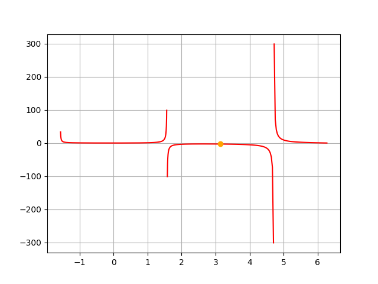
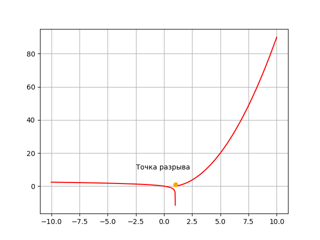

<h2 style="text-align: center;">Бюджетное учреждение высшего образования Ханты-Мансийского автономного округа – Югры</h2>

<h1 style="text-align: center;">«СУРГУТСКИЙ ГОСУДАРСТВЕННЫЙ УНИВЕРСИТЕТ»</h1>

<h2 style="text-align: center;">Политехнический институт</h2>

<p style="text-align: center;">Кафедра прикладной математики</p>

<p style="text-align: center;">Бондаренко Анна Андреевна</p>

<h1 style="text-align: center;">Числовые последовательности </h1>

<p style="text-align: center;">Дисциплина «Математический анализ»</p>

<p style="text-align: center;">направление 01.03.02 «Прикладная математика и информатика»</p>

<p style="text-align: center;">направленность (профиль): «Технологии программирования и анализ данных»</p>

<pre>

</pre>

<p style="text-align: right;">Преподаватель:  </p>

<p style="text-align: right;">Ряховский Алексей Васильевич, доцент</p>

<p style="text-align: right;">Студент гр. № 601-31</p>

<p style="text-align: right;">Бондаренко Анна Андреевна</p>

<pre>


</pre>

<p style="text-align: center;">Сургут 2023 г.</p>

<h3 style="text-align: center;">Лабораторная работа №2.</h3>

#### Задание

1. Аналитически найти область определения функций, а затем построить их графики, используя графические пакеты Python. Для каждой из функций график построить на отдельном рисунке.
2. Вычислить пределы данных функций двумя способами: аналитически и используя библиотеки Python для символьных вычислений. Используя графические пакеты Python, построить графики функций, иллюстрирующие поведение функций в окрестностях тех точек, в которых вычисляется предел. Если предел существует, построить на соответствующем рисунке точку, изображающую предел данной функции.
3. Найти (аналитически и используя библиотеки Python для символьных вычислений) точки разрыва функции и определить их тип. Используя графические пакеты Python построить графики функций, иллюстрирующие поведение функций в окрестностях точек разрыва.

#### Задача 1

Найти область определения и построить графики следующих функций:

$\frac{x}{x-2}$ , $arcsin(\frac{2}{x+3})$

Найдем область определения первой функции:

$\frac{x}{x-2}$

$x-2= 0 \rightarrow x \neq 2$

Отсюда следует, что $x \in (- \infty, 2) \cup (2, + \infty)$

Найдем область определения второй функции:

$arcsin(\frac{2}{x+3})$

Область определения арксинуса это все значения $x$, при которых аргумент принадлежит промежутку $[-1,1]$ :

$\frac{2}{x+3} \in [-1,1]$

Решим систему:

$$\begin{cases} \frac{2}{x+3} \geq -1 \\ \frac{2}{x+3} \leq 1
\end{cases}$$

$$\begin{cases} \frac{2+x+3}{x+3} \geq 0 \\
\frac{2-(x+3)}{x+3} \leq 0
\end{cases}$$

$$\begin{cases} \frac{5+x}{x+3} \geq 0 \\
\frac{-1-x}{x+3} \leq 0
\end{cases}$$

$$\begin{cases} \begin{cases} 5+x \geq 0 \\ x+3 > 0 \end{cases} \\
\begin{cases} 5+x \leq 0 \\\ x+3 < 0 \end{cases} \\
\begin{cases} -1-x \leq0 \\ x+3 > 0 \end{cases} \\
\begin{cases} -1-x \geq 0 \\ x+3 <0 \end{cases}
\end{cases}$$

$$\begin{cases} \begin{cases} x \geq 5 \\ x > -3 \end{cases} \\
\begin{cases} x \leq -5 \\ x < -3 \end{cases} \\
\begin{cases} x \geq -1 \\ x > -3 \end{cases} \\
\begin{cases} x \leq -1 \\ x < -3 \end{cases}
\end{cases}$$

Найдем объединение и пересечение всех получившихся промежутков:

$x \in (-\infty, -5] \cup [-1, +\infty)$

Построим графики данных функций

Программа:

```python
import matplotlib.pyplot as plt
import numpy as np
import sympy as sp
from sympy import Symbol,limit
from math import pi,log


def pic1():
    x = [round(i, 2) for i in np.arange(-20, 21, 0.1)]
    y = [round((i/(i-2)),2) for i in x]
    plt.plot(x, y, linewidth=2, color='red')
    plt.title('График функции x/(x-2)', fontsize=15)
    plt.xlabel('x', fontsize=14)
    plt.ylabel('y', fontsize=14) 
    plt.grid(True)
def pic2():
    x = np.linspace(-15,11,1000)
    y = np.arcsin(2/(x+3))
    plt.plot(x, y, linewidth=2, color='blue')
    plt.title('График функции arcsin(2/(x+3))', fontsize=15)
    plt.xlabel('x', fontsize=14)
    plt.ylabel('y', fontsize=14) 
    plt.grid(True)

plt.figure()
pic1()
plt.figure()
pic2()
plt.show()


```

Результат работы программы:


<p style="text-align: center;">Рис. 1.</p>


<p style="text-align: center;">Рис. 2.</p>

#### Задача 2

Вычислить пределы данных функций двумя способами: аналитически и используя библиотеки Python для символьных вычислений. Используя графические пакеты Python, построить графики функций, иллюстрирующие поведение функций в окрестностях тех точек, в которых вычисляется предел. Если предел существует, построить на соответствующем рисунке точку, изображающую предел данной функции.

Функция: $\frac{xtgx}{\pi-x}$

Вычислим предел этой функции

$\lim\limits_{x\rightarrow\pi}\frac{xtgx}{\pi-x}$

Найдем пределы числителя и знаменателя:

- $\lim\limits_{x\rightarrow\pi}xtgx=0$
- $\lim\limits_{x\rightarrow\pi}(\pi-x)=0$

Поскольку выражение $\frac{0}{0}$ является неопределенностью, преобразуем его с помощью замены переменных:

$y = \pi-x \rightarrow x = \pi+y$

$\lim\limits_{x\rightarrow\pi}\frac{xtgx}{\pi-x}= \lim\limits_{y\rightarrow0}\frac{(\pi+y)tg(\pi+y)}{\pi-(\pi+y)}$

Воспользуемся правилом приведения: $tg(\pi+y)= tgy$

$\lim\limits_{y\rightarrow0}\frac{(\pi+y)tg(\pi+y)}{\pi-(\pi+y)} = -\lim\limits_{y\rightarrow0}\frac{(\pi+y)tgy}{y}$

Воспользуемся следствием из первого замечательного предела:

$-\lim\limits_{y\rightarrow0}\frac{(\pi+y)tgy}{y} = - \lim\limits_{y\rightarrow0}(\pi+y)=-\pi$

Программа для вычиления предела заданной функции и построения графика функции:

```python
import matplotlib.pyplot as plt
import numpy as np
import sympy as sp
from sympy import Symbol,limit
from math import pi,log


x1 = np.linspace(-np.pi/2 + 0.01, np.pi/2 - 0.01, 1000)
y1 = x1 * np.tan(x1) / (np.pi - x1)
x2 = np.linspace(np.pi/2 + 0.01, np.pi - 0.01, 1000)
y2 = x2 * np.tan(x2) / (np.pi - x2)
x3 = np.linspace(np.pi + 0.01, 3*np.pi/2 - 0.01)
y3 = x3 * np.tan(x3) / (np.pi - x3)
x4 = np.linspace(3*np.pi/2 + 0.01, 2*np.pi - 0.01)
y4 = x4 * np.tan(x4) / (np.pi - x4)

n = Symbol('n') 
a = limit(n * sp.tan(n) / (sp.pi - n), n, sp.pi)
print(a)

plt.plot(x1, y1, x2, y2, x3, y3, x4, y4, color='red')
plt.plot(pi,a,'o', color='orange')
plt.grid(True)
plt.show()
```

Результат работы программы:



<p style="text-align: center;">Рис. 3. График функции и предел данной функции.</p>


<p style="text-align: center;">Рис. 4. Вывод результата в терминале.</p>

#### Задача 3

Найти (аналитически и используя библиотеки Python для символьных вычислений) точки разрыва функции и определить их тип. Используя графические пакеты Python построить графики функций, иллюстрирующие поведение функций в окрестностях точек разрыва.

Функция:

$$f(x) = \begin{cases}ln(1-x), если \text{ } x < 1 \\
x^2 - x, если\text{ } x \geq 1\end{cases}$$

Найдем пределы этой функции при $x$ стремящемся к 1 слева и справа

Предел слева:

$\lim\limits_{x\rightarrow1-0}ln(1-x)$

Логарифм в нуле неопределен, следовательно, точка с координатами $(1, 0)$ является асимптотой графика функции $ln(1-x)$. Функция $ln(1-x)$ - убывающая, следовательно:

$\lim\limits_{x\rightarrow1-0}ln(1-x) = -\infty$

Предел справа:

$\lim\limits_{x\rightarrow1+0}(x^2 - x) = 0$

Эти два односторонних предела не равны между собой, а предел функции слева не является конечным, значит точка $1$ является точкой разрыва 2-го рода.

Программа для вычисления односторонних пределов и построения графика функции:

```python
import matplotlib.pyplot as plt
import numpy as np
import sympy as sp
from sympy import Symbol,limit
from math import pi,log


x1 = np.linspace(-10,0.99999, 1000)
y1 = np.log(1 - x1)
x2 = np.linspace(1, 10, 1000)
y2 = [i*i - i for i in x2]
n = Symbol('n')
lp = limit(sp.log(1 - n), n, 1, dir='-')
rp = limit(n*n - n, n, 1, dir='+')
print(f" Предел функции слева {lp}, справа {rp}")
plt.plot(x1,y1,x2,y2, color='red')
plt.plot(1,1,'ro', color='orange')
plt.text(-2.5,10, 'Точка разрыва')
plt.grid(True)
plt.show()

```

Результат работы программы:



<p style="text-align: center;">Рис. 5. График функции и точка разрыва данной функции.</p>


<p style="text-align: center;">Рис. 6. Вывод результата в терминале.</p>
