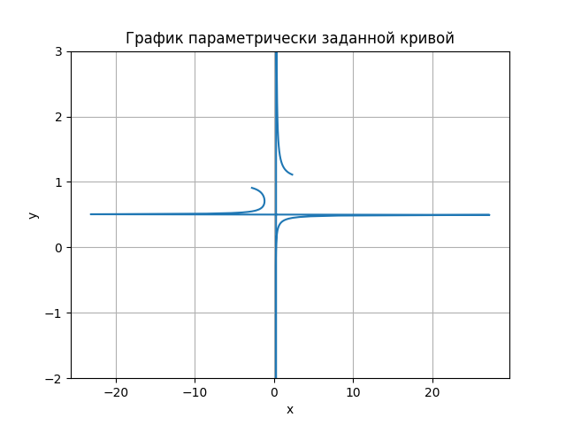
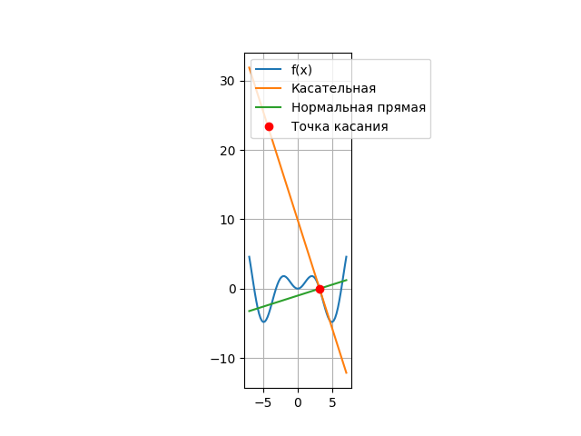

<h2 style="text-align: center;">Бюджетное учреждение высшего образования Ханты-Мансийского автономного округа – Югры</h2>

<h1 style="text-align: center;">«СУРГУТСКИЙ ГОСУДАРСТВЕННЫЙ УНИВЕРСИТЕТ»</h1>

<h2 style="text-align: center;">Политехнический институт</h2>

<p style="text-align: center;">Кафедра прикладной математики</p>

<p style="text-align: center;">Бондаренко Анна Андреевна</p>

<h1 style="text-align: center;">Параметрически заданные кривые. Производная, дифференциал.</h1>

<p style="text-align: center;">Дисциплина «Математический анализ»</p>

<p style="text-align: center;">направление 01.03.02 «Прикладная математика и информатика»</p>

<p style="text-align: center;">направленность (профиль): «Технологии программирования и анализ данных»</p>

<pre>

</pre>

<p style="text-align: right;">Преподаватель:  </p>

<p style="text-align: right;">Ряховский Алексей Васильевич, доцент</p>

<p style="text-align: right;">Студент гр. № 601-31</p>

<p style="text-align: right;">Бондаренко Анна Андреевна</p>

<pre>


</pre>

<p style="text-align: center;">Сургут 2023 г.</p>

<h3 style="text-align: center;">Лабораторная работа №3.</h3>

#### Задание

1. Используя графические пакеты Python построить параметрически 
заданную кривую.
2. Для заданной функции 𝑓(𝑥) аналитически найти уравнения касательной прямой и нормальной прямой в указанной точке 𝑥0. Используя графические пакеты Python построить на одном рисунке график функции 𝑓(𝑥), касательную прямую, нормальную прямую и отметить точку касания.

#### Задача 1
Используя графические пакеты Python построить параметрически 
заданную кривую.

$x = \frac{1+t^2}{4(1-t)}$

$y = \frac{t}{1+t}$

#### Программное решение

```python
import matplotlib.pyplot as plt 
import numpy as np


t = np.linspace(-10,10,500) 
x = (1+t*t)/(4*(1-t))
y = t/(1+t)

fig, ax = plt.subplots()
ax.plot(x,y)
ax.set_title('График параметрически заданной кривой')
ax.set_xlabel('x')
ax.set_ylabel('y')
ax.grid(True)
plt.ylim(-2,3)
plt.show()

```



<p style="text-align: center;">Рис. 1.</p>

#### Задача 2

Для заданной функции 𝑓(𝑥) аналитически найти уравнения касательной прямой и нормальной прямой в указанной точке 𝑥0. Используя графические пакеты Python построить на одном рисунке график функции 𝑓(𝑥), касательную прямую, нормальную прямую и отметить точку касания.

$f(x) = xsinx$

$x_0 = \pi$

#### Аналитическое решение
Найдем производную данной функции:

$(xsinx)' = x'sinx + x(sinx)'= sinx+xcosx$

Найдем значение производной в точке $x_0=\pi$:

$f'(x_0)=f'(\pi)= sin\pi+\pi cos\pi = -\pi$

Найдем значение функции в точке $x_0$:

$f(x_0)=\pi sin\pi = 0$

Следовательно, уравнение касательной принимает вид:

$y = f(x_0)+f'(x_0)(x-x_0)= -\pi(x-\pi)$

Уравнение нормальной прямой будет перпендикулярным касательной прямой и проходящим через точку касания.

Уравнение нормальной прямой:

$y=f(x_0)-\frac{1}{f'(x_0)}(x-x_0) = \frac{1}{\pi}(x-\pi)$

#### Программное решение

```python
import matplotlib.pyplot as plt 
import numpy as np


def f(x):
    return x * np.sin(x)

def kasat(x):
    return -np.pi*(x-np.pi)

def normal(x):
    return 1/np.pi*(x-np.pi)

x = np.linspace(-7,7,70)
y = f(x)

plt.plot(x,y, label = 'f(x)')
plt.plot(x,kasat(x), label = 'Касательная')
plt.plot(x,normal(x), label = 'Нормальная прямая')
plt.plot(np.pi, f(np.pi), 'ro', label = 'Точка касания')
plt.gca().set_aspect('equal')
plt.legend()
plt.grid()
plt.show()

```



<p style="text-align: center;">Рис. 2.</p>