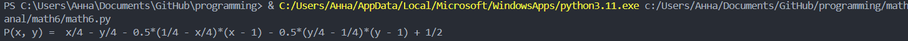

<h2 style="text-align: center;">Бюджетное учреждение высшего образования Ханты-Мансийского автономного округа – Югры</h2>

<h1 style="text-align: center;">«СУРГУТСКИЙ ГОСУДАРСТВЕННЫЙ УНИВЕРСИТЕТ»</h1>

<h2 style="text-align: center;">Политехнический институт</h2>

<p style="text-align: center;">Кафедра прикладной математики</p>

<p style="text-align: center;">Бондаренко Анна Андреевна</p>

<h1 style="text-align: center;">Формула Тейлора. Криволинейные интегралы. </h1>

<p style="text-align: center;">Дисциплина «Математический анализ»</p>

<p style="text-align: center;">направление 01.03.02 «Прикладная математика и информатика»</p>

<p style="text-align: center;">направленность (профиль): «Технологии программирования и анализ данных»</p>

<pre>

</pre>

<p style="text-align: right;">Преподаватель:  </p>

<p style="text-align: right;">Ряховский Алексей Васильевич, доцент</p>

<p style="text-align: right;">Студент гр. № 601-31</p>

<p style="text-align: right;">Бондаренко Анна Андреевна</p>

<pre>


</pre>

<p style="text-align: center;">Сургут 2024 г.</p>

<h3 style="text-align: center;">Лабораторная работа №7.</h3>

#### Задание 1
Аналитически и средствами Python найти многочлен Тейлора 2-й 
степени в точке для заданной функции:

$f(x, y) = \frac{x}{x + y},  M=(1,1)$

#### Программное решение

```python
from sympy import symbols, diff, sin, cos 
 
x, y = symbols("x y") 
f = x/(x + y)
 
df_dx = diff(f, x) # частная производная по x 
df_dy = diff(f, y) # частная производная по y

df_dxdx = diff(df_dx, x) # смешанная производная по х
df_dxdy = diff(df_dx, y) # смешанная производная по х и у
df_dydy = diff(df_dy, y) # смешанная производная по у
 
args = [(x, 1), (y, 1)] # аргументы для подстановки, x = 1, y = 1 
 
df = df_dx.subs(args)*x + df_dy.subs(args)*y # первый дифференциал 
df2 = -(1/2)*(df_dxdx.subs(args)*(x - 1)*(x - 1) + 2*df_dxdy.subs(args)*(x - 1)*(y - 1) + df_dydy.subs(args)*(y - 1)*(y - 1)) # второй дифференциал
Taylor_polynomial = f.subs(args) + df + df2 # многочлен Тейлора 2-й степени 
 
print("P(x, y) = ", Taylor_polynomial)
```


<p style="text-align: center;">Рис. 1. Вывод результата в терминале.</p>

#### Задание 2

1) Средствами Python изобразить кривую  , по которой производится 
интегрирование. На рисунке подписать координатные оси и точки, указанные 
в задании. 
2) Ввести параметрическое представление кривой, приведя все необходимые 
вычисления. 
3) Свести криволинейный интеграл 2-го рода к обычному определенному 
интегралу и вычислить его аналитически и средствами Python. 
4) Проверить зависит ли интеграл от пути интегрирования и, если нет, то 
найти функцию       , для которой подынтегральное выражение является 
полным дифференциалом, и вычислить интеграл с ее помощью (только 
аналитически). 

Интеграл
#### $\int_\gamma^\ y\mathrm{d}x + \mathrm{d}y$
где $\gamma$ - ломаная $ABC$, соединяющая точки $A=(0,0)$, $B=(0,2)$ и $C=(1,1)$.

#### 1. Программа
```python
import matplotlib.pyplot as plt

# Определим координаты точек
A = (0, 0)
B = (0, 2)
C = (1, 1)

# Создаём массивы x и y для построения ломаной
x = [A[0], B[0], C[0]]
y = [A[1], B[1], C[1]]

# Создаём график
plt.plot(x, y, marker='o')

# Подписываем точки
plt.text(A[0] - 0.1, A[1] - 0.1, 'A(0,0)', fontsize=12)
plt.text(B[0] - 0.1, B[1] + 0.1, 'B(0,2)', fontsize=12)
plt.text(C[0] + 0.05, C[1] - 0.1, 'C(1,1)', fontsize=12)

# Подписываем оси
plt.xlabel('x')
plt.ylabel('y')

# Устанавливаем границы графика
plt.xlim(-0.5, 1.5)
plt.ylim(-0.5, 2.5)

# Показываем сетку
plt.grid()

# Показываем график
plt.title('Кривая ABC')
plt.show()
```
