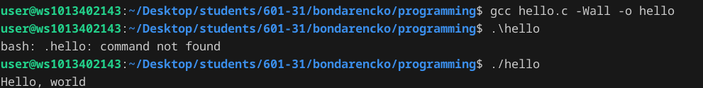
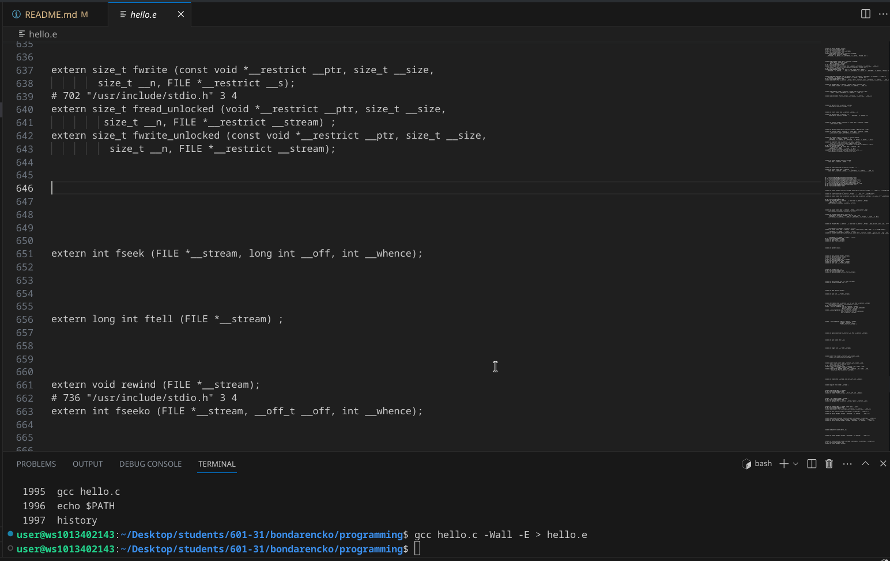
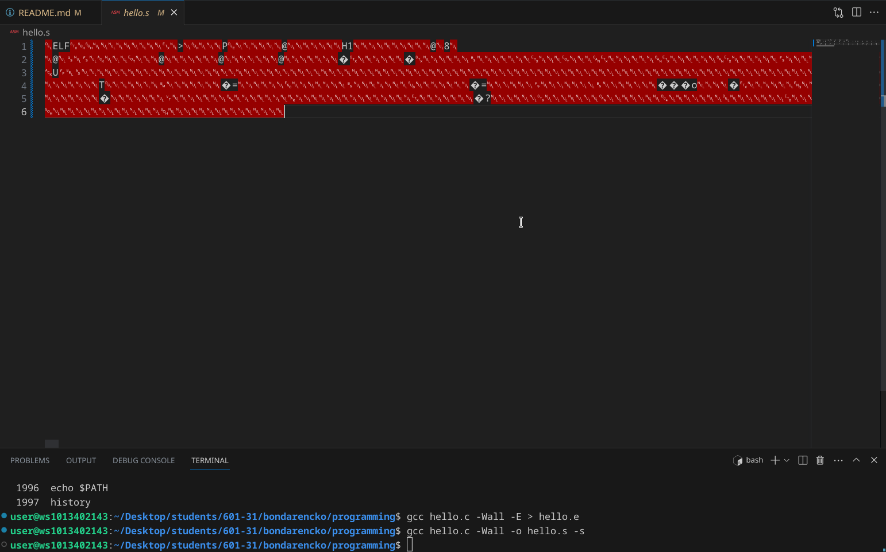
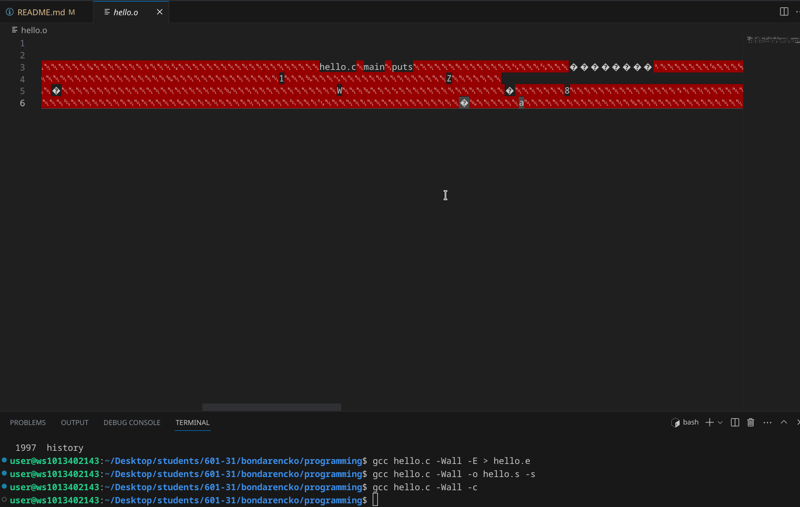
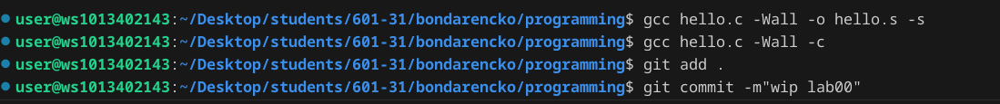
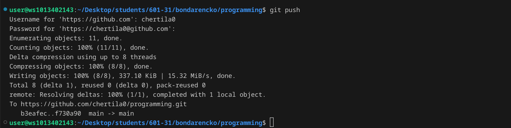

# Лабораторная работа №0
## Задание
1. Создайте репозиторий для дисциплины на GitHub.
2. Склонируйте его себе на ПК.
3. Напишите свою первую программу.
4. Скомпилируйте и запустите её.
5. Получите по отдельности результаты каждого этапа компиляции.
6. Напишите отчёт в README.md. Отчёт должен содержать:
    * Задание
    * Описание проделанной работы
    * Консольные команды
    * Скриншоты результатов
    * Ссылки на используемые материалы
    * Сделайте коммит и пуш.
    * Добавьте для себя в отчёт шпаргалку по работе с git.
## Ход работы

### 1. Создайте репозиторий для дисциплины на GitHub
Ссылка на репозиторий:
https://github.com/chertila0/programming 
### 2. Склонируйте его себе на ПК
```shell
git clone https://github.com/chertila0/programming.git

```
### 3. Напишите свою первую программу
Программа:
```c
#include <stdio.h>

int main()
{
    printf("Hello, world\n");
    return 0;
}

```
### 4. Скомпилируйте и запустите её

### 5. Получите по отдельности результаты каждого этапа компиляции
#### Препроцессор

#### Компилятор

#### Объектные файлы

### 6. Oтчёт в README.md
#### Это отчёт в README.md
### 7. Сделайте коммит и пуш


### 8.Добавьте для себя в отчёт шпаргалку по работе с git
> git clone
>> Клонирование репозитория: пользователь начинает работу с вышестоящего репозитория на GitHub. Процесс начинается с клонирования репозитория на локальную машину. Теперь у пользователя есть точная копия файлов проекта в их системе, чтобы внести изменения

> git add .
>> Команда добавляет изменения из рабочего каталога в раздел проиндексированных файлов

> git commit
>> Команда делает для проекта снимок текущего состояния изменений, добавленных в раздел проиндексированных файлов. Такие подтвержденные снимки состояния можно рассматривать как "безопасные" версии проекта - Git не будет их менять, пока вы явным образом не попросите об этом.

> git push
>> Команда позволяет отправлять локальную ветку на удаленный репозиторий. Она помогает разработчикам синхронизироваться в команде, а именно отправляет проделанные изменения.
