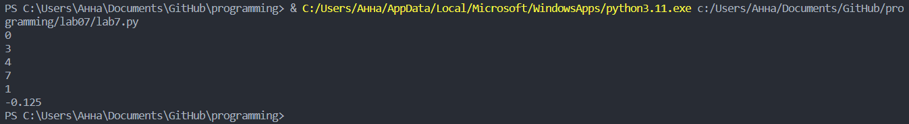
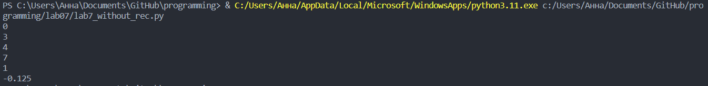

# Лабораторная работа №7
## Задание
1. Напишите две функции для решения задач своего варианта - с использованием рекурсии и без.
2. Оформите отчёт в README.md

## Ход работы 
### 1. Напишите две функции для решения задач своего варианта - с использованием рекурсии и без

#### С рекурсией: 

```python
def count(lst):
    s = 0
    for i in lst:
        if isinstance(i, list):
            s += count(i) + 1
        else:
            s += 1
    return s


def calculate_xi(n):
    if n == 1:
        return 1
    if n == 2:
        return -1 / 8
    return ((n - 1) * calculate_xi(n - 1)) / 3 + ((n - 2) * calculate_xi(n - 2)) / 4


print(count([]))
print(count([1, 2, 3]))
print(count(["x", "y", ["z"]]))
print(count([1, 2, [3, 4, [5]]]))
print(calculate_xi(1))
print(calculate_xi(2))

```
#### Результат:


#### Без рекурсии:

```python
def count(lst):
    stack = lst
    count = 0
    while stack:
        current = stack.pop()
        if isinstance(current, list):
            stack.extend(current)
            count += 1
        else:
            count += 1
    return count

def calculate_xi(n):
    if n == 1:
        return 1
    if n == 2:
        return -1 / 8
    xi_2 = 1
    xi_1 = -1 / 8
    xi = 0
    for i in range(3, n+1):
        xi = ((i - 1) * xi_1) / 3 + ((i - 2) * xi_2) / 4
        xi_2 = xi_1
        xi_1 = xi
    return xi

print(count([]))
print(count([1, 2, 3]))
print(count(["x", "y", ["z"]]))
print(count([1, 2, [3, 4, [5]]]))
print(calculate_xi(1))
print(calculate_xi(2))
```

#### Результат:


### 2. Оформите отчёт в README.md
Это и есть отчет в README.md))