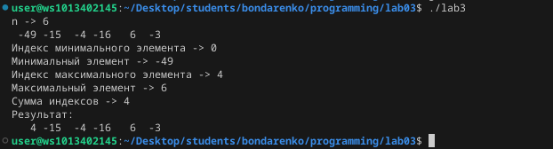

# Лабораторная работа №3
## Задание
1. Напишите программу по своему варианту. 
2. Оформите отчёт в README.md. Отчёт должен содержать:

    *Задание

    *Описание проделанной работы

    *Скриншоты результатов

    *Ссылки на используемые материалы
## Ход работы
### 1. Напишите программу по своему варианту. 
#### Вариант 1
Найти сумму индексов максимального и минимального элемента массива, если она меньше/больше по модулю минимума/максимума соответственно, записать её на их место, иначе обнулить массив между минимум и максимумом.
#### Программа:
```
#include <stdio.h>
#include <stdlib.h>
#include <time.h>
#include <math.h>

void fill(int n, int a[])
{
    int i;
    for (i = 0; i < n; i++)
    a[i] = rand () % 101 - 50;
}

void minmax(int n, int A[])
{
    int i, imin, imax, min, max;
    min = 52;
    max = 0;
    for (i = 0; i < n; i++)
        {   
            if (A[i] > max)
            {
                max = A[i];
                imax = i;
            }
            if (A[i] < min)
                {
                    min = A[i];
                    imin = i;
                }
        }
    printf("\n");
    printf("Индекс минимального элемента -> %d\n", imin);
    printf("Минимальный элемент -> %d\n", min);
    printf("Индекс максимального элемента -> %d\n", imax);
    printf("Максимальный элемент -> %d\n", max);
    printf("Сумма индексов -> %d\n", imin + imax);
    if ((imin + imax) < fabs(min))
        A[imin] = imin + imax;
    else if ((imin + imax) > fabs(max))
        A[imax] = imin + imax;
    else
        {
            if (imin < imax)
                for (i = imin + 1; i < imax && i > imin; i++)
                    A[i] = 0;
            if (imin > imax)
                for (i = imax + 1; i < imin && i > imax; i++)
                    A[i] = 0;         
        }
}

void newmas(int n, int A[])
{
    int i;
    printf("Результат: \n");
    for (i = 0; i < n; i++)
        printf("%4d", A[i]);
    printf("\n");
}

int main()
{
    srand(time(NULL));
    int n;
    printf("n -> ");
    scanf("%d", &n);
    int A[n];
    fill(n, A);
    newmas(n, A);
    minmax(n, A);
    newmas(n, A);
}
```
#### Результат:

### 2. Оформите отчёт в README.md.
Это и есть отчет)